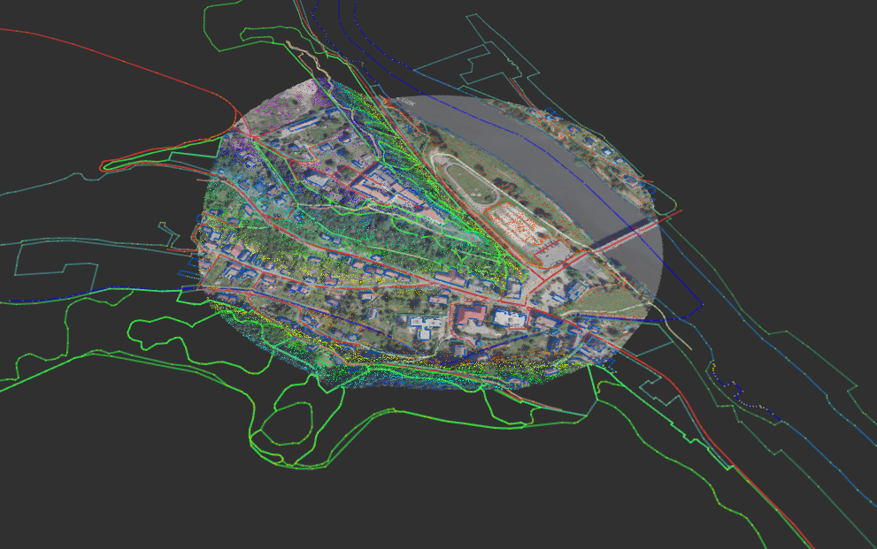

# CUZK-TOOLS

## Description
The ROS package **cuzk_tools** contains ROS nodes providing ROS services using open data from the [Czech State Administration of Land Surveying and Cadastre (**CUZK**)](https://geoportal.cuzk.cz/(S(1bww4u03zr1k4oogfysuwvpu))/Default.aspx?lng=EN&head_tab=sekce-02-gp&mode=TextMeta&text=dSady_uvod&menu=20&news=yes).

Here is an overview of the provided functionalities, note that when coordinate frames are mentioned, only the following are considered: sjtsk, utm, utm_local, wgs:
 - node: **elevation** (and **pose_elevation_srv** and **pose_elevation_tf**)
    - services:
      - **/elevation_get**: retrieve (x,y,elevation) points from radius R around point P in selected coordinate frames
      - **/elevation_publish**: publish (x,y, elevation) points from radius R around point P in selected coordinate frames (each frame is published on a separate topic)
      - **/point_elevation_get AND  /geopoint_elevation_get**: for point (x,y) in frame F get point with elevation (x,y,elevation) in the same coordinate frame
      - **/set_elevation_tf**: set which tf frame is being republished with elevation information added to it (e.g. base_link:(x,y)->base_link_elev:(x,y,elevation)) (there needs to exist a transformation between your selected frame and the 'utm' frame)
      
    - topics: 
      - **/elevation_{frame}**: PointCloud2 of DMR5G points (x,y,elevation) in given coordinate frame; produced by elevation_publish

 - node: **orto2mesh**
   - topic:
      - **/elevation_utm_local_orto_mesh**: visualization_msgs/Marker generated from photo of the location (Ortofoto CUZK data) and point cloud elevation_{frame} 

 - node: **topography**
    - service: 
      - **/topography**: for given point P in coordinate frame F and radius R retrieves and publishes all ZABAGED objects in that area as GeographicMap
    - topics: 
        - **/topography/{category}**, where {category} is one of the following:
          - buildings
          - roads
          - rails
          - footways
          - water
          - forest
          - antiforest
          - agriculture
          - untraversable
          - traversable
          - obstacles
        - **/visualization_marker_array**: visualization of the objects (points,lines,polygons) above; colour-coding specified by config/geomap_colours.yaml


## Nodes
### Elevation
#### Data

This node uses the [DMR 5G data](https://geoportal.cuzk.cz/(S(5tcbldqpcpjqzpc4gvmqdw5a))/Default.aspx?lng=EN&mode=TextMeta&side=vyskopis&metadataID=CZ-CUZK-DMR5G-V&mapid=8&menu=302), which is a digital elevation model of the Czech Republic. The data is in the form of 3D points with the x and y coordinates given in the [S-JTSK coordinate system](https://cs.wikipedia.org/wiki/Syst%C3%A9m_jednotn%C3%A9_trigonometrick%C3%A9_s%C3%ADt%C4%9B_katastr%C3%A1ln%C3%AD) ([EPSG:5514](https://epsg.io/5514)) and the z coordinate representing the altitude in the Balt height reference system after levelling ([Bpv](https://cs.wikipedia.org/wiki/Baltsk%C3%BD_po_vyrovn%C3%A1n%C3%AD)).

The stated mean height error of DMR 5G is 0.18 m in exposed terrain and 0.3 m in forested terrain. The data itself does not contain any additional information regarding the error of individual points.

The DMR 5G data is stored in the form of 2.5 km wide and 2 km high tiles. These tiles are freely available for download for example by [zooming on an area in a map](https://ags.cuzk.cz/geoprohlizec/?atom=dmr5g) or choosing from an [XML file](https://atom.cuzk.cz/DMR5G-SJTSK/DMR5G-SJTSK.xml) more suited for machine access.

The latter is also used in the elevation service provided by this node.

#### Example Workflow

1. Launch the node with:
`roslaunch cuzk_tools elevation.launch`

2. Call the elevation service:
```
rosservice call /elevation_publish "point: {x: 14.0, y: 50.0, z: 0.0}
  radius: {data: 300.0}
  sjtsk: {data: false}
  utm: {data: false}
  utm_local: {data: true}
  wgs: {data: false}" 
```
where **x** is the **longitude** (!!!), **y** is the **latitude** (!!!) in WGS84 (no matter what frame we are publishing in, the input is always in WGS, to not over-complicate things) (!!!), z is arbitrary and **radius** is given in **meters**.

3. The node then calculates which tiles are needed and either retrieves them from cache or downloads them (you need to be online if that is the case (!!!)). Afterwards it filters out points outside the given radius.

4. The elevation data is then published to the **elevation_{frame}** topic as [PointCloud2](http://docs.ros.org/en/melodic/api/sensor_msgs/html/msg/PointCloud2.html) and can be viewed in rviz (if you followed the above steps, rviz should be open and focused in a way, that you can see the point-cloud and mesh).

#### Example Service Calls

```
rosservice call /elevation_get "point: {x: 14.0, y: 50.0, z: 0.0}
  radius: {data: 400.0}
  sjtsk: {data: false}
  utm: {data: true}
  utm_local: {data: true}
  wgs: {data: false}"
```

```
rosservice call /elevation_publish "point: {x: 14.0, y: 50.0, z: 0.0}
  radius: {data: 400.0}
  sjtsk: {data: false}
  utm: {data: false}
  utm_local: {data: false}
  wgs: {data: true}"
```

```
rosservice call /geopoint_elevation_get "point:
  latitude: 50.0
  longitude: 14.0
  altitude: 0.0
frame:
  data: 'wgs'" 
```

```
rosservice call /point_elevation_get "point:
  x: 21.0
  y: 42.0
  z: 0.0
frame:
  data: 'utm_local'" 
```

```
rosservice call /set_elevation_tf "frame:
  data: 'base_link'" 
```

### Topography
#### Data
This node uses the The Fundamental Base of Geographic Data of the Czech Republic ([ZABAGED](https://geoportal.cuzk.cz/(S(1bww4u03zr1k4oogfysuwvpu))/Default.aspx?lng=EN&mode=TextMeta&text=dSady_zabaged&side=zabaged&menu=24)). The data describes objects in a vectorized form either as a Point, (Multi)LineString or (Multi)Polygon. These objects are split into 139 categories such as 'Building, block of buildings', 'Road, motorway', 'Railway line', 'Castle' etc. Each object is usually listed in only one category, so for example the Hněvín Castle is a 'Castle' but not a 'Building, block of buildings'.

The data is stored in a single file, containing the entirety of Czechia (with the size of 12.3 GB).

#### Example Workflow

1. (first time running) Open https://atom.cuzk.cz/ZABAGED-GPKG/ZABAGED-GPKG.xml

2. (first time running) Inside, find and open link which looks like this https://atom.cuzk.cz/ZABAGED-GPKG/datasetFeeds/CZ-00025712-CUZK_ZABAGED-GPKG_1.xml (it seems to be always exactly this link, but I cannot ensure you, that it won't change)

3. (first time running) Inside, find and download from link which looks like https://openzu.cuzk.cz/opendata/ZABAGED-GPKG/epsg-5514/ZABAGED-5514-gpkg-20240102.zip **(!!!) this link changes with time (!!!) must contain epsg-5514 (!!!)**

4. (first time running) Save the downloaded `data.gpkg` file ideally over at `$HOME/.ros/cache/cuzk_tools/topography/data.gpkg` (or on another path, but then you need to change some of the paths hardcoded in this package)

5. (first time running) Run `gpkg_parser.py` (just a one time thing) to split the giant data file into smaller ones. This can take some time (~40 minutes). If it crashes due to no RAM, consider decreasing the `RAM_LIMIT` in `gpkg_parser.py`.
---------------------------
6. Launch `roslaunch cuzk_tools topography.launch`

7. Call topography service:
```rosservice call /topography "point:
  x: 14.0
  y: 50.0
  z: 0.0
radius:
  data: 500.0
frame:
  data: 'utm_local'"
```
As with the elevation node, the input point is in WGS coordinates (x=long (!!!), y=lat (!!!)). Set `frame` to one of sjtsk, utm, utm_local and wgs.

8. rviz should be open by now where you can see the topography objects visualized as Markers (if you followed the steps exactly).


### Elevation with Topography

If you are looking to combine both visualizations (i.e. elevation & ortofoto mesh with topography markers) you can run `elev_topo.launch`. You then call the `elevation_publish` and `topography` services as indicated above and both visualizations should appear in rviz:




### Remarks
 - The topography node produces a GeographicMap for the ZABAGED data. It should be relatively simple to use a different GeographicMap source together with the visualization (e.g. OSM data). The categories that I use with ZABAGED (I reduce their 139 categories to 11 custom ones) should overlap well with OSM.

 - All of the data covers strictly Czechia only.

 - I have mostly tested things with the `utm_local` frame. It is possible there could be some constellation with the other frames and parameters, that could be buggy. But using `utm_local` should, to my knowledge, be without problems.

 - The services are relatively computation heavy. There is likely space for optimization.

 - The way the data is handled and stored on the side of CUZK can change in which case errors can occur.

 - This package was developed with no *concrete* usage in mind, more as a general (visualization) tool.

 - This map can be used to browse the topography data: https://www.arcgis.com/home/webmap/viewer.html?url=http%3A%2F%2Fags.cuzk.cz%2Farcgis%2Frest%2Fservices%2FZABAGED_POLOHOPIS%2FMapServer&source=sd

 - This map is good to play around with different coordinate systems in Czechia https://ags.cuzk.cz/geoprohlizec/ (click MENU upper left)